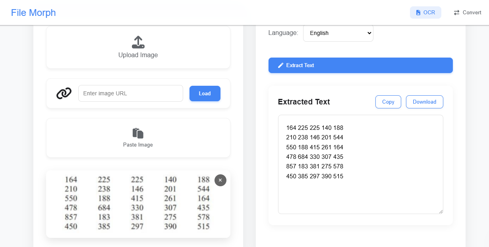
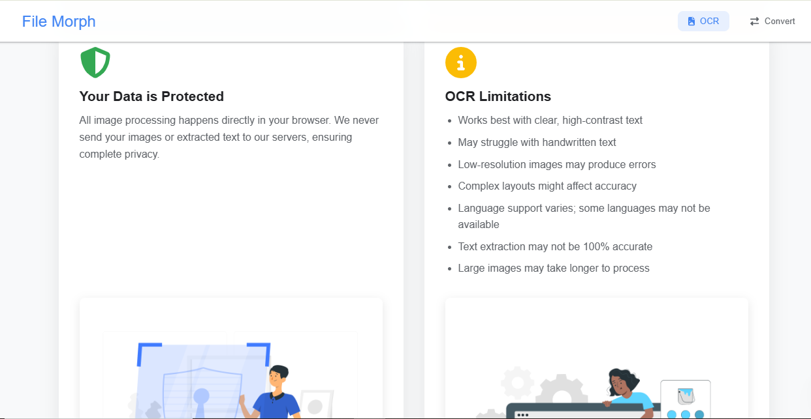
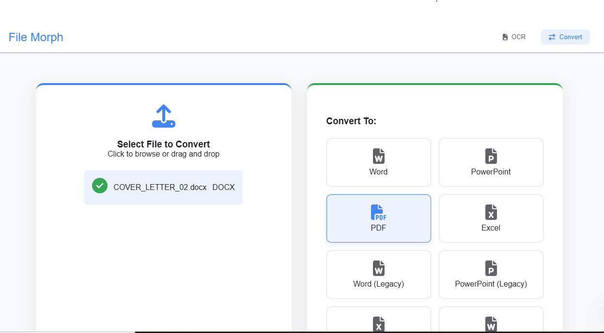
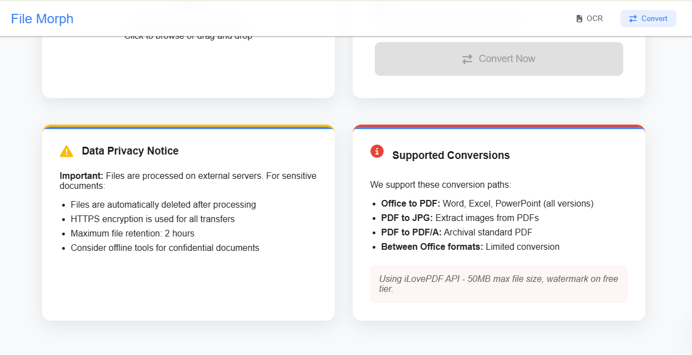

# FileMorph - File Conversion and OCR Tool



**🔗 Live Demo:** [https://file-morph-six.vercel.app/](https://file-morph-six.vercel.app/)  
**📁 Repository:** [https://github.com/AbdulAHAD968/FILE-MORPH](https://github.com/AbdulAHAD968/FILE-MORPH)

FileMorph is a versatile web application that combines OCR (Optical Character Recognition) and file conversion capabilities in one convenient interface. Extract text from images or convert files between popular formats with ease.

---

## 🚀 Features

### 📷 OCR Functionality

- Extract text from uploaded images  
- Support for cloud images via URL  
- Paste images directly from clipboard  
- Multi-language support:  
  English, French, Spanish, German, Chinese, Hindi, Arabic  
- Download or copy extracted text

---

---

### 🔄 File Conversion

- Convert between popular document formats  
- Supported formats:
  - Word (DOCX)
  - PowerPoint (PPTX)
  - PDF
  - Plain Text (TXT)
- Simple drag-and-drop interface

---

---

## 🛠️ Technologies Used

- **Frontend:** React.js  
- **OCR:** Tesseract.js  
- **File Conversion:** Mammoth.js, other conversion libraries  
- **UI:** Font Awesome icons, custom CSS  
- **Build:** Create React App (or preferred build tool)

---

---

## 🧪 Installation

To run FileMorph locally:

```bash
git clone https://github.com/AbdulAHAD968/FILE-MORPH.git
cd filemorph
npm install
npm start
```

Then open your browser and visit:

```bash
http://localhost:3000
```

---

## 📖 Usage

### 🔍 OCR Tab

- [x] Upload an image file or paste from clipboard
- [x] Select the language of the text
- [x] Click Extract Text
- [x] Copy or download the extracted text

### 🔄 Convert Tab

- [x] Upload the file you want to convert
- [x] Select the target format
- [x] Click Convert
- [x] Download the converted file

---

## 📁 Project Structure

``` bash 
filemorph/
├── dist/
├── public/
├── src/
│   ├── components/
│   │   ├── FileConverter.jsx   # File conversion logic
│   │   ├── FileMorph.jsx       # Main application container
│   │   └── OCR.jsx             # OCR functionality
|   |   ├── OtherFiles
│   ├── App.js
│   ├── index.js
│   └── OCR.css                # Styles for the application
├── README.md
├── LICENSE
├── index.html

```

---

## 🤝 Contributing
1. Contributions are welcome! Follow these steps:
2. Fork the project
3. Create your feature branch:
```bash
git checkout -b feature/AmazingFeature
```
4. Commit your changes:
```bash
git commit -m 'Add some amazing feature'
```
5. Push to the branch:
```bash
git push origin feature/AmazingFeature
```
6. Open a Pull Request

---

## 🔮 Future Enhancements

1. Add more file conversion formats
1. Implement batch processing
1. Add image preprocessing for better OCR accuracy
1. Support for handwritten text recognition
1. Dark mode support

---

## 📄 License
This project is licensed under the MIT License. See the LICENSE file for details.

---

## Acknowledgments
- Tesseract.js – OCR engine
- Font Awesome – Icons
- React – Frontend framework
- iLovePDF – For file conversion inspiration and API_KEY as well..
